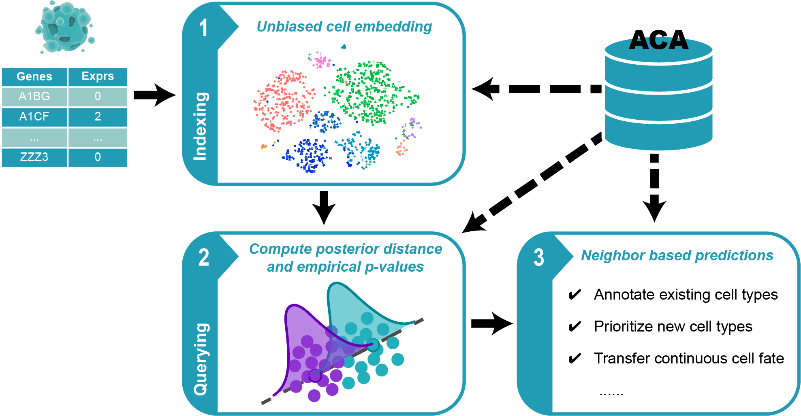

# Cell BLAST

Cell BLAST is a cell querying tool for single-cell transcriptomics data.

For each query cell, it searches for most similar cells in the reference database.
Annotations in reference cells, e.g. cell type, can then be transfered to query
cells based on cell-to-cell similarities. See our
[preprint](https://www.biorxiv.org/content/10.1101/587360v1) for details.

## Installing the python package

We only support installation via pip right now.

Installation within virtual environments are recommended, see
[virtualenv](https://virtualenv.pypa.io/en/latest/) or
[conda](https://conda.io/docs/user-guide/tasks/manage-environments.html).

For conda, here's a one-liner to set up an empty environment
for installing Cell BLAST:

`conda create -n cb python=3.6 && source activate cb`

Now follow the instructions below to install Cell BLAST:

1. Make sure you have a working version of tensorflow or tensorflow-gpu
   (version >= 1.5). You can follow the
   [official instructions](https://www.tensorflow.org/install/)
   about how to install tensorflow (and dependencies like CUDA and CuDNN
   for the GPU version), or just install via anaconda, which handles
   dependencies automatically:

   For installing the GPU supported version:
   `conda install tensorflow-gpu=1.8`

   For installing the CPU only version:
   `conda install tensorflow=1.8`

2. Install Cell BLAST by running:
   `pip install Cell-BLAST`

3. Check if the package can be imported in python interpreter:
   `import Cell_BLAST as cb`

Online documentation can be found [here](http://cblast.gao-lab.org/doc/index.html).

## Web-based interface

We also provide a [Web-based service](http://cblast.gao-lab.org/) for
off-the-shelf querying of our ACA reference panels.

## Repository structure

* The `Cell_BLAST` directory contains the Cell BLAST python package.
* The `Datasets` directory contains scripts used for building the ACA database.
* The `Evaluation` directory contains scripts used for benchmarking
  and producing some figures of the manuscript.
* The `doc` directory contains files used to generate the online documentation.
* The `test` directory contains unit tests for the python package.

## Contact

Feel free to submit an issue or contact us at
[cblast@mail.cbi.pku.edu.cn](mailto:cblast@mail.cbi.pku.edu.cn)
for problems about the python package, website or database.
