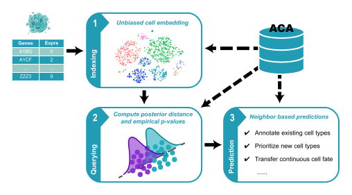

.. Cell BLAST documentation master file, created by
   sphinx-quickstart on Tue Nov 27 01:35:22 2018.
   You can adapt this file completely to your liking, but it should at least
   contain the root `toctree` directive.

Welcome to Cell BLAST's documentation!
======================================

**Cell_BLAST** is a single cell transcriptome querying tool, based on
a deep generative model (currently named **DIRECTi**).

**Cell_BLAST** performs querying based on low-dimensional cell embeddings
learned by a generative model, with cell-to-cell similarity estimated using
the distance between their posterior distributions. Annotations like cell types
can then be transferred from reference to query cells based on query hits.

Contents
========

.. toctree::
   :maxdepth: 2

   install
   start
   api
   migration

Indices and tables
==================

* :ref:`genindex`
* :ref:`modindex`
* :ref:`search`

Publication
===========
`Searching large-scale scRNA-seq databases via unbiased cell embedding with Cell BLAST <https://www.nature.com/articles/s41467-020-17281-7>`_
